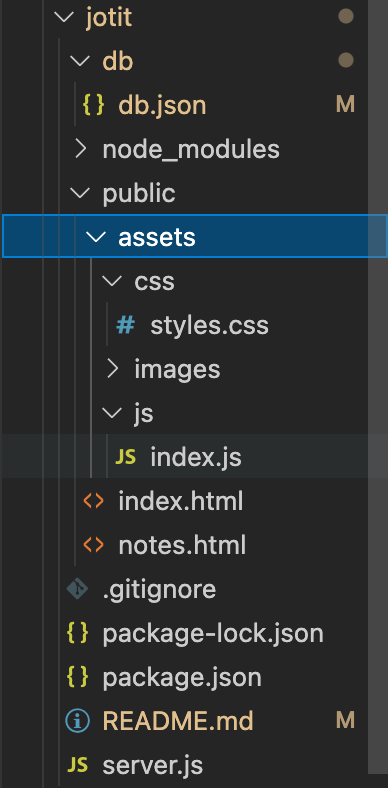
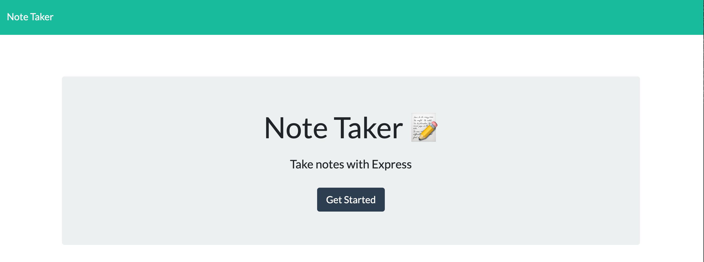
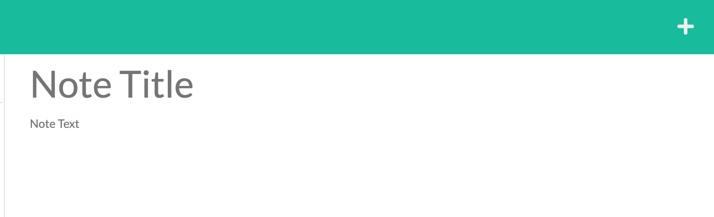
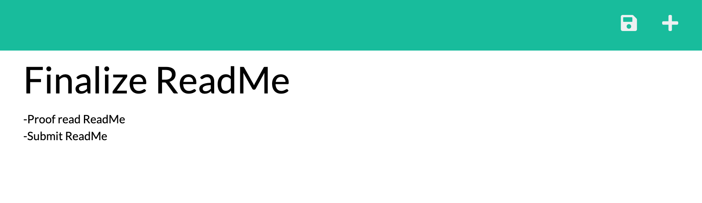
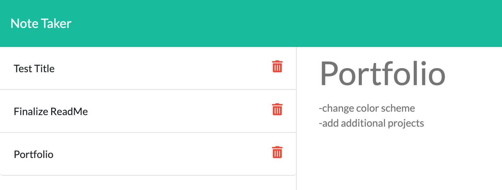

# jotit

## Description 

A simple and convenient note taking app that allows the user to organize their notes and keep track of tasks at hand. With the ability to write, save and delete notes to better organize your tasks!

Checkout [JotIt!](https://floating-peak-63791.herokuapp.com/)

## Table of Contents 

* [Technologies Used](#technologies-used)
* [Installation](#installation)
* [Usage](#usage)
* [License](#license)

## Technologies Used

* JavaScript
* JQuery
* Express.js
* Uniqid npm
* Bootstrap
* Heroku

## Installation

1. Git clone the application and run `npm install` in the terminal to download all necessary packages.
2. The folder system should resemble: 

    

3. In terminal run `npm start` to begin server.
4. Navigate to `http://localhost:3001/` in order to view the website.

## Usage 

Click on `Get Started` to be taken to the note organizer:

You can add notes by click on the `+` on the top right of the page:

Click inside the text fields `Note Title` and `Note Text` and begin entering tasks to better organize your thoughts

After clicking on the save icon :floppy_disk: in the top right, the note will be added to the left-hand side of the page for quick access

Simply click on the note title in the left-hand side in order to display the note contents. Once you no longer need the note, click on the red trashcan icon :wastebasket: in order to delete notes!

## License

MIT License

© 2021 The Brokers Inc.

Permission is hereby granted, free of charge, to any person obtaining a copy
of this software and associated documentation files (the "Software"), to deal
in the Software without restriction, including without limitation the rights
to use, copy, modify, merge, publish, distribute, sublicense, and/or sell
copies of the Software, and to permit persons to whom the Software is
furnished to do so, subject to the following conditions:

The above copyright notice and this permission notice shall be included in all
copies or substantial portions of the Software.

THE SOFTWARE IS PROVIDED "AS IS", WITHOUT WARRANTY OF ANY KIND, EXPRESS OR
IMPLIED, INCLUDING BUT NOT LIMITED TO THE WARRANTIES OF MERCHANTABILITY,
FITNESS FOR A PARTICULAR PURPOSE AND NONINFRINGEMENT. IN NO EVENT SHALL THE
AUTHORS OR COPYRIGHT HOLDERS BE LIABLE FOR ANY CLAIM, DAMAGES OR OTHER
LIABILITY, WHETHER IN AN ACTION OF CONTRACT, TORT OR OTHERWISE, ARISING FROM,
OUT OF OR IN CONNECTION WITH THE SOFTWARE OR THE USE OR OTHER DEALINGS IN THE
SOFTWARE.